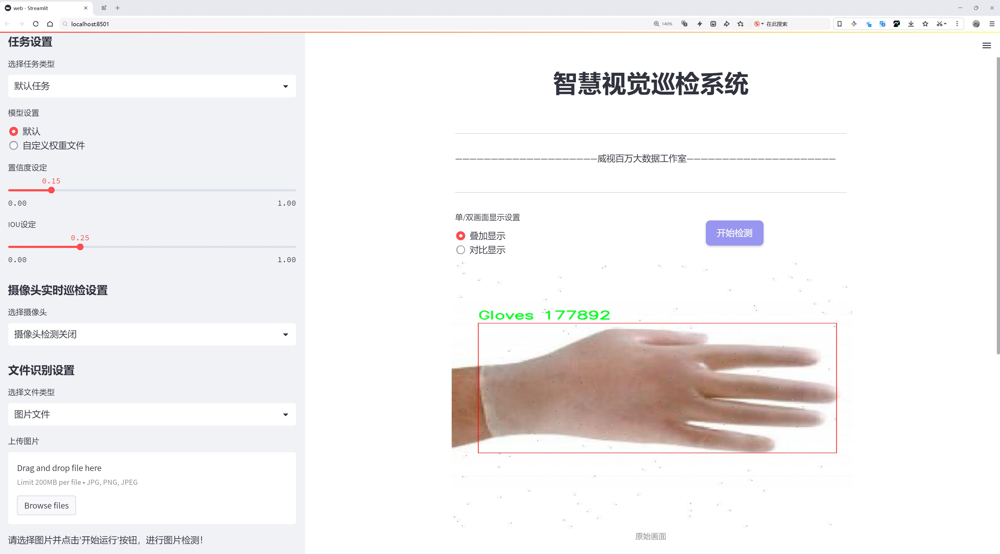
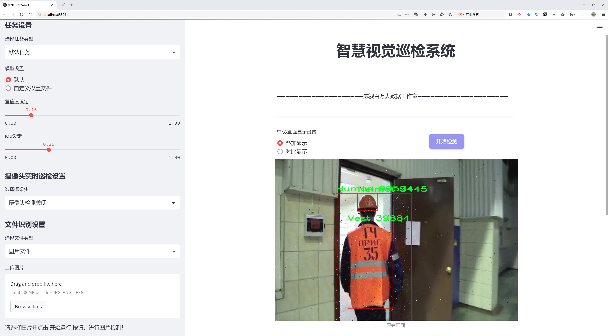
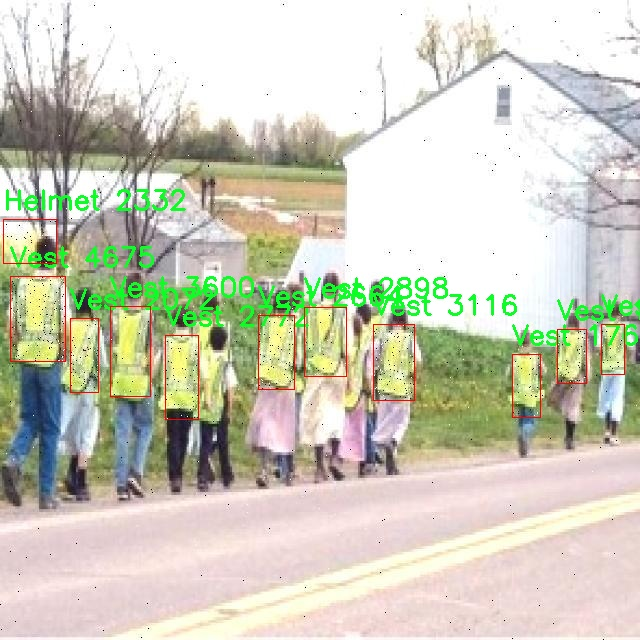

# 安全装备检测检测系统源码分享
 # [一条龙教学YOLOV8标注好的数据集一键训练_70+全套改进创新点发刊_Web前端展示]

### 1.研究背景与意义

项目参考[AAAI Association for the Advancement of Artificial Intelligence](https://gitee.com/qunshansj/projects)

项目来源[AACV Association for the Advancement of Computer Vision](https://gitee.com/qunmasj/projects)

研究背景与意义

随着工业化进程的加快和城市化的不断推进，安全生产和个人安全日益成为社会各界关注的焦点。在建筑工地、制造业、交通运输等领域，工人们的安全装备（如安全帽和安全背心）是保障其人身安全的重要防线。然而，尽管相关法规和标准日益完善，实际操作中仍然存在安全装备佩戴不规范、检查不及时等问题，导致事故频发。因此，开发一种高效、准确的安全装备检测系统，能够实时监测和识别工人佩戴的安全装备，对于提升工作场所的安全性具有重要的现实意义。

在这一背景下，计算机视觉技术的迅猛发展为安全装备的自动检测提供了新的解决方案。YOLO（You Only Look Once）系列模型作为一种先进的目标检测算法，以其高效性和准确性在各类视觉任务中表现突出。特别是YOLOv8模型，通过改进的网络结构和算法优化，能够在保证检测精度的同时，显著提高检测速度，适用于实时监控场景。因此，基于改进YOLOv8的安全装备检测系统，能够为工地等高风险环境提供实时监测，及时发现未佩戴或不规范佩戴安全装备的情况，从而有效降低事故发生率。

本研究所使用的数据集“Helmet_Vest”包含4242张图像，涵盖了5个类别，包括安全帽、背心和人员。这一数据集的丰富性和多样性为模型的训练和测试提供了良好的基础。通过对不同类别的样本进行标注和分类，模型能够学习到各类安全装备的特征，从而实现对佩戴情况的准确识别。此外，数据集中人员的存在不仅增强了模型对安全装备与环境的适应能力，也为实际应用中复杂场景下的检测提供了更多的训练样本。

本研究的意义不仅在于技术层面的创新，更在于其对社会安全的积极影响。通过实现对安全装备的自动检测，能够有效提升安全管理的效率，减少人工检查的工作量，降低人为失误的风险。同时，该系统的推广应用，能够增强工人对安全装备佩戴重要性的认识，形成良好的安全文化氛围，进而促进安全生产的整体提升。

综上所述，基于改进YOLOv8的安全装备检测系统的研究，不仅具有重要的学术价值，也具备广泛的应用前景。通过结合先进的计算机视觉技术与实际安全管理需求，本研究旨在为提升工作场所的安全性贡献一份力量，为构建更安全的生产环境奠定基础。

### 2.图片演示






##### 注意：由于此博客编辑较早，上面“2.图片演示”和“3.视频演示”展示的系统图片或者视频可能为老版本，新版本在老版本的基础上升级如下：（实际效果以升级的新版本为准）

  （1）适配了YOLOV8的“目标检测”模型和“实例分割”模型，通过加载相应的权重（.pt）文件即可自适应加载模型。

  （2）支持“图片识别”、“视频识别”、“摄像头实时识别”三种识别模式。

  （3）支持“图片识别”、“视频识别”、“摄像头实时识别”三种识别结果保存导出，解决手动导出（容易卡顿出现爆内存）存在的问题，识别完自动保存结果并导出到tempDir中。

  （4）支持Web前端系统中的标题、背景图等自定义修改，后面提供修改教程。

  另外本项目提供训练的数据集和训练教程,暂不提供权重文件（best.pt）,需要您按照教程进行训练后实现图片演示和Web前端界面演示的效果。

### 3.视频演示

[3.1 视频演示](https://www.bilibili.com/video/BV1MEtieyEij/)

### 4.数据集信息展示

##### 4.1 本项目数据集详细数据（类别数＆类别名）

nc: 5
names: ['Boots', 'Gloves', 'Helmet', 'Human', 'Vest']


##### 4.2 本项目数据集信息介绍

数据集信息展示

在现代安全装备检测系统的研究中，数据集的构建与应用至关重要。本研究所采用的数据集名为“Helmet_Vest”，旨在为改进YOLOv8模型提供高质量的训练数据，以提升其在安全装备检测中的准确性和鲁棒性。该数据集专注于五种关键类别的安全装备和相关人员，具体包括：Boots（靴子）、Gloves（手套）、Helmet（头盔）、Human（人类）和Vest（背心）。这些类别不仅涵盖了个人防护装备的基本组成部分，还考虑到了在各种工作环境中可能出现的人员形态，从而为模型的训练提供了丰富的样本。

“Helmet_Vest”数据集的类别数量为五个，涵盖了安全装备的核心要素。首先，Boots作为重要的个人防护装备，能够有效保护工人在危险环境中的脚部安全。其次，Gloves则是防止手部受伤的重要装备，尤其是在处理尖锐物体或化学品时，其重要性不言而喻。Helmet是工人安全的第一道防线，能够有效防止头部受到重物坠落或撞击的伤害。Human类别则代表了在工作场所中穿戴这些安全装备的人员形象，帮助模型学习如何识别装备与人之间的关系。最后，Vest作为另一种重要的防护装备，通常用于提高工人在低能见度环境中的可见性，确保他们的安全。

数据集的构建过程包括对每一类别的样本进行精心挑选和标注，以确保数据的多样性和代表性。每个类别中的样本均来自不同的工作环境，包括建筑工地、制造业车间、仓储物流中心等，这些场景的多样性使得模型能够在实际应用中具备更强的适应能力。此外，数据集中的图像经过精细处理，确保了高分辨率和清晰度，以便于YOLOv8模型在训练过程中提取特征。

在数据集的标注过程中，采用了先进的标注工具和技术，确保每个样本的准确性和一致性。每个图像中的目标物体均被精确框选，并附上相应的类别标签。这种高质量的标注不仅有助于提升模型的训练效果，还能有效减少模型在推理阶段的误判率，从而提高安全装备检测的可靠性。

通过使用“Helmet_Vest”数据集，研究者能够在YOLOv8模型的基础上进行针对性的改进，优化其在安全装备检测中的性能。数据集的设计理念与实际应用场景紧密结合，使得模型不仅能够识别单一装备，还能理解装备与人员之间的关系，从而实现更为智能化的安全监测。这一数据集的应用前景广阔，未来可望在工业安全、建筑施工、物流运输等多个领域发挥重要作用，为提升工作场所的安全性提供有力支持。

总之，“Helmet_Vest”数据集为改进YOLOv8的安全装备检测系统提供了坚实的基础，其丰富的类别信息和高质量的样本标注将为未来的研究和应用开辟新的方向。




### 5.全套项目环境部署视频教程（零基础手把手教学）

[5.1 环境部署教程链接（零基础手把手教学）](https://www.ixigua.com/7404473917358506534?logTag=c807d0cbc21c0ef59de5)


[5.2 安装Python虚拟环境创建和依赖库安装视频教程链接（零基础手把手教学）](https://www.ixigua.com/7404474678003106304?logTag=1f1041108cd1f708b01a)

### 6.手把手YOLOV8训练视频教程（零基础小白有手就能学会）

[6.1 手把手YOLOV8训练视频教程（零基础小白有手就能学会）](https://www.ixigua.com/7404477157818401292?logTag=d31a2dfd1983c9668658)

### 7.70+种全套YOLOV8创新点代码加载调参视频教程（一键加载写好的改进模型的配置文件）

[7.1 70+种全套YOLOV8创新点代码加载调参视频教程（一键加载写好的改进模型的配置文件）](https://www.ixigua.com/7404478314661806627?logTag=29066f8288e3f4eea3a4)

### 8.70+种全套YOLOV8创新点原理讲解（非科班也可以轻松写刊发刊，V10版本正在科研待更新）

由于篇幅限制，每个创新点的具体原理讲解就不一一展开，具体见下列网址中的创新点对应子项目的技术原理博客网址【Blog】：


[8.1 70+种全套YOLOV8创新点原理讲解链接](https://gitee.com/qunmasj/good)

### 9.系统功能展示（检测对象为举例，实际内容以本项目数据集为准）

图9.1.系统支持检测结果表格显示

  图9.2.系统支持置信度和IOU阈值手动调节

  图9.3.系统支持自定义加载权重文件best.pt(需要你通过步骤5中训练获得)

  图9.4.系统支持摄像头实时识别

  图9.5.系统支持图片识别

  图9.6.系统支持视频识别

  图9.7.系统支持识别结果文件自动保存

  图9.8.系统支持Excel导出检测结果数据


### 10.原始YOLOV8算法原理

原始YOLOv8算法原理

YOLO（You Only Look Once）系列算法自2015年首次提出以来，已经历经多个版本的迭代，逐步发展成为一种高效的单阶段目标检测算法。最新的YOLOv8版本在检测精度和速度上都取得了显著的提升，成为了当前计算机视觉领域中的一项重要技术。YOLOv8的设计理念是将目标检测任务简化为一个回归问题，通过将图像划分为网格并在每个网格中直接预测边界框和类别概率，从而实现实时的目标检测。

YOLOv8的网络结构主要由四个部分组成：输入层、Backbone骨干网络、Neck特征融合网络和Head检测模块。输入层负责对输入图像进行预处理，包括图像的缩放、裁剪以及数据增强等操作。特别是YOLOv8引入了Mosaic增强技术，它通过将多张图像拼接在一起，增加了训练数据的多样性，进而提升了模型的泛化能力。此外，YOLOv8还采用了自适应锚框计算和自适应灰度填充，进一步优化了输入数据的处理流程。

在Backbone部分，YOLOv8沿用了DarkNet结构，但进行了重要的改进。YOLOv8用C2f模块替代了之前版本中的C3模块，这一变化显著增强了模型的特征提取能力。C2f模块通过多分支的跨层连接，能够有效地捕捉到不同层次的特征信息，形成更为丰富的梯度流动。这种设计不仅保留了轻量级特性，还提升了特征表示能力，使得YOLOv8在处理复杂场景时表现得更加出色。为了进一步增强特征图的表达能力，YOLOv8还引入了SPPF（Spatial Pyramid Pooling Fusion）模块，通过不同内核尺寸的池化操作，对特征图进行多尺度融合，确保了模型在不同尺度目标检测中的鲁棒性。

Neck部分采用了双塔结构，结合了特征金字塔网络（FPN）和路径聚合网络（PAN），实现了对语义特征和定位特征的有效融合。这种结构的设计使得YOLOv8能够在不同尺度的目标检测中保持较高的精度，特别是在小目标和大目标的检测上表现尤为突出。通过特征融合，YOLOv8能够更好地捕捉到图像中的关键信息，提升了模型的整体性能。

在Head检测模块中，YOLOv8引入了解耦头的结构，将回归分支和分类分支进行分离。这一设计的优势在于能够加速模型的收敛，提高检测精度。具体而言，YOLOv8的Head模块包含三个Detect检测器，分别负责不同尺度目标的检测任务。通过解耦头的设计，YOLOv8能够更灵活地处理目标检测中的复杂情况，从而实现更高的检测精度。

YOLOv8的训练过程同样经过了精心设计。模型的深度和宽度可以通过depth_factor和width_factor进行调节，确保在不同的应用场景中都能达到最佳的性能。通过设置合适的参数，YOLOv8能够在保证模型轻量化的同时，提升其检测精度。此外，YOLOv8在损失计算过程中采用了Task Aligned Assigner策略，根据分类与回归的分数加权结果选择正样本，从而优化了正负样本的分配，提高了模型的训练效率。

在损失函数的选择上，YOLOv8结合了二元交叉熵损失（BCELoss）和分布焦点损失（DFLoss），以及完全交并比损失函数（CIOULoss），从而提升了模型对边界框预测的精准性。这种多损失函数的组合，使得YOLOv8在处理目标检测任务时，能够更好地平衡分类和回归的精度，进一步增强了模型的性能。

总的来说，YOLOv8作为YOLO系列的最新版本，充分体现了深度学习在目标检测领域的进步。通过对网络结构的优化和训练策略的改进，YOLOv8在检测精度、速度和易用性等方面都表现出色，成为了当前业界最流行和成功的目标检测算法之一。随着YOLOv8的广泛应用，未来的研究将可能集中在进一步提升模型的鲁棒性和适应性上，以应对更加复杂的实际应用场景。


### 11.项目核心源码讲解（再也不用担心看不懂代码逻辑）

#### 11.1 70+种YOLOv8算法改进源码大全和调试加载训练教程（非必要）\ultralytics\models\yolo\classify\val.py

以下是对给定代码的核心部分进行提炼和详细注释的结果：

```python
# 导入必要的库
import torch
from ultralytics.data import ClassificationDataset, build_dataloader
from ultralytics.engine.validator import BaseValidator
from ultralytics.utils import LOGGER
from ultralytics.utils.metrics import ClassifyMetrics, ConfusionMatrix
from ultralytics.utils.plotting import plot_images

class ClassificationValidator(BaseValidator):
    """
    继承自BaseValidator类的分类验证器，用于基于分类模型的验证。
    """

    def __init__(self, dataloader=None, save_dir=None, pbar=None, args=None, _callbacks=None):
        """初始化ClassificationValidator实例，设置数据加载器、保存目录、进度条和参数。"""
        super().__init__(dataloader, save_dir, pbar, args, _callbacks)
        self.targets = None  # 存储真实标签
        self.pred = None     # 存储预测结果
        self.args.task = 'classify'  # 设置任务类型为分类
        self.metrics = ClassifyMetrics()  # 初始化分类指标

    def init_metrics(self, model):
        """初始化混淆矩阵、类名和准确率指标。"""
        self.names = model.names  # 获取模型的类名
        self.nc = len(model.names)  # 类别数量
        self.confusion_matrix = ConfusionMatrix(nc=self.nc, conf=self.args.conf, task='classify')  # 初始化混淆矩阵
        self.pred = []  # 预测结果列表
        self.targets = []  # 真实标签列表

    def preprocess(self, batch):
        """预处理输入批次并返回处理后的数据。"""
        batch['img'] = batch['img'].to(self.device, non_blocking=True)  # 将图像数据转移到设备上
        batch['img'] = batch['img'].half() if self.args.half else batch['img'].float()  # 根据参数选择数据类型
        batch['cls'] = batch['cls'].to(self.device)  # 将类别标签转移到设备上
        return batch

    def update_metrics(self, preds, batch):
        """使用模型预测和批次目标更新运行指标。"""
        n5 = min(len(self.names), 5)  # 取前5个预测结果
        self.pred.append(preds.argsort(1, descending=True)[:, :n5])  # 记录预测结果
        self.targets.append(batch['cls'])  # 记录真实标签

    def finalize_metrics(self, *args, **kwargs):
        """最终化模型的指标，如混淆矩阵和速度。"""
        self.confusion_matrix.process_cls_preds(self.pred, self.targets)  # 处理预测和真实标签以更新混淆矩阵
        if self.args.plots:  # 如果需要绘图
            for normalize in True, False:
                self.confusion_matrix.plot(save_dir=self.save_dir, names=self.names.values(), normalize=normalize, on_plot=self.on_plot)  # 绘制混淆矩阵
        self.metrics.speed = self.speed  # 记录速度
        self.metrics.confusion_matrix = self.confusion_matrix  # 记录混淆矩阵
        self.metrics.save_dir = self.save_dir  # 记录保存目录

    def get_stats(self):
        """返回通过处理目标和预测获得的指标字典。"""
        self.metrics.process(self.targets, self.pred)  # 处理真实标签和预测结果
        return self.metrics.results_dict  # 返回结果字典

    def build_dataset(self, img_path):
        """创建并返回一个ClassificationDataset实例，使用给定的图像路径和预处理参数。"""
        return ClassificationDataset(root=img_path, args=self.args, augment=False, prefix=self.args.split)

    def get_dataloader(self, dataset_path, batch_size):
        """构建并返回一个用于分类任务的数据加载器。"""
        dataset = self.build_dataset(dataset_path)  # 构建数据集
        return build_dataloader(dataset, batch_size, self.args.workers, rank=-1)  # 返回数据加载器

    def print_results(self):
        """打印YOLO模型的评估指标。"""
        pf = '%22s' + '%11.3g' * len(self.metrics.keys)  # 打印格式
        LOGGER.info(pf % ('all', self.metrics.top1, self.metrics.top5))  # 打印top-1和top-5准确率

    def plot_val_samples(self, batch, ni):
        """绘制验证图像样本。"""
        plot_images(
            images=batch['img'],
            batch_idx=torch.arange(len(batch['img'])),  # 批次索引
            cls=batch['cls'].view(-1),  # 类别标签
            fname=self.save_dir / f'val_batch{ni}_labels.jpg',  # 保存文件名
            names=self.names,
            on_plot=self.on_plot)

    def plot_predictions(self, batch, preds, ni):
        """在输入图像上绘制预测结果并保存结果。"""
        plot_images(batch['img'],
                    batch_idx=torch.arange(len(batch['img'])),  # 批次索引
                    cls=torch.argmax(preds, dim=1),  # 预测类别
                    fname=self.save_dir / f'val_batch{ni}_pred.jpg',  # 保存文件名
                    names=self.names,
                    on_plot=self.on_plot)  # 绘制预测结果
```

### 代码分析
1. **类定义**：`ClassificationValidator`类用于分类模型的验证，继承自`BaseValidator`。
2. **初始化**：构造函数中初始化了目标、预测、任务类型和指标。
3. **指标初始化**：`init_metrics`方法用于初始化混淆矩阵和类名。
4. **数据预处理**：`preprocess`方法负责将输入批次的数据转移到适当的设备并进行类型转换。
5. **更新指标**：`update_metrics`方法用于更新模型的预测和真实标签。
6. **最终化指标**：`finalize_metrics`方法处理混淆矩阵和绘制图形。
7. **获取统计信息**：`get_stats`方法返回处理后的指标。
8. **数据集和数据加载器**：`build_dataset`和`get_dataloader`方法用于构建数据集和数据加载器。
9. **结果打印和绘图**：`print_results`、`plot_val_samples`和`plot_predictions`方法用于打印结果和绘制图像。

以上是对代码的核心部分提炼和详细注释，帮助理解其功能和结构。

这个文件是一个用于YOLOv8分类模型验证的Python脚本，主要实现了对分类模型的验证过程。它继承自`BaseValidator`类，提供了一系列方法来处理分类任务的验证，包括数据预处理、指标更新、结果输出等。

首先，文件导入了必要的库和模块，包括PyTorch和Ultralytics库中的一些组件。这些组件用于数据集构建、数据加载、模型验证和指标计算等。

`ClassificationValidator`类是这个文件的核心，构造函数初始化了一些参数，包括数据加载器、保存目录、进度条和其他参数。它还定义了任务类型为分类，并初始化了分类指标的实例。

在`get_desc`方法中，返回了一个格式化的字符串，用于总结分类指标，包括类别名称、Top-1准确率和Top-5准确率。

`init_metrics`方法用于初始化混淆矩阵、类别名称和准确率指标。`preprocess`方法则对输入批次进行预处理，将图像和类别标签转移到指定的设备上，并根据需要转换数据类型。

`update_metrics`方法用于更新模型预测和批次目标的运行指标。它将预测结果按降序排序，并记录前5个预测结果。`finalize_metrics`方法则在所有数据处理完成后，处理混淆矩阵并生成最终的指标结果。

`get_stats`方法返回处理后的指标结果字典。`build_dataset`和`get_dataloader`方法分别用于创建分类数据集实例和构建数据加载器，以便在验证过程中使用。

`print_results`方法用于打印YOLO模型的评估指标，提供了Top-1和Top-5准确率的输出。`plot_val_samples`和`plot_predictions`方法用于可视化验证样本和模型预测结果，分别生成带有真实标签和预测标签的图像。

总体而言，这个文件提供了一个完整的框架，用于对YOLOv8分类模型进行验证，涵盖了从数据加载、预处理、指标计算到结果可视化的各个方面。通过这个验证器，用户可以方便地评估模型在分类任务上的性能。

#### 11.2 ui.py

以下是代码中最核心的部分，并附上详细的中文注释：

```python
import sys
import subprocess

def run_script(script_path):
    """
    使用当前 Python 环境运行指定的脚本。

    Args:
        script_path (str): 要运行的脚本路径

    Returns:
        None
    """
    # 获取当前 Python 解释器的路径
    python_path = sys.executable

    # 构建运行命令，使用 streamlit 运行指定的脚本
    command = f'"{python_path}" -m streamlit run "{script_path}"'

    # 执行命令
    result = subprocess.run(command, shell=True)
    # 检查命令执行的返回码，如果不为0，表示执行出错
    if result.returncode != 0:
        print("脚本运行出错。")

# 实例化并运行应用
if __name__ == "__main__":
    # 指定要运行的脚本路径
    script_path = "web.py"  # 这里可以直接指定脚本名称，假设在当前目录下

    # 调用函数运行脚本
    run_script(script_path)
```

### 代码注释说明：
1. **导入模块**：
   - `sys`：用于访问与 Python 解释器相关的变量和函数。
   - `subprocess`：用于执行外部命令。

2. **定义 `run_script` 函数**：
   - 此函数接受一个参数 `script_path`，表示要运行的 Python 脚本的路径。
   - 函数内部首先获取当前 Python 解释器的路径，以便在后续的命令中使用。

3. **构建命令**：
   - 使用 `streamlit` 模块运行指定的脚本。构建的命令格式为：`python -m streamlit run script_path`。

4. **执行命令**：
   - 使用 `subprocess.run` 方法执行构建的命令。`shell=True` 允许在 shell 中执行命令。
   - 检查命令的返回码，如果返回码不为0，表示执行过程中出现错误，打印相应的错误信息。

5. **主程序入口**：
   - 在 `if __name__ == "__main__":` 块中，指定要运行的脚本路径，并调用 `run_script` 函数来执行该脚本。

这个程序文件名为 `ui.py`，其主要功能是使用当前的 Python 环境来运行一个指定的脚本，具体是通过 Streamlit 来启动一个 Web 应用。

程序首先导入了必要的模块，包括 `sys`、`os` 和 `subprocess`，以及一个自定义的 `abs_path` 函数，该函数来自于 `QtFusion.path` 模块，可能用于获取文件的绝对路径。

在 `run_script` 函数中，程序接收一个参数 `script_path`，这个参数是要运行的脚本的路径。函数的第一步是获取当前 Python 解释器的路径，这通过 `sys.executable` 实现。接着，程序构建了一个命令字符串，该命令使用当前的 Python 解释器来运行指定的脚本，具体的命令格式是 `python -m streamlit run script_path`。

然后，程序使用 `subprocess.run` 来执行这个命令，`shell=True` 参数允许在 shell 中执行命令。执行完命令后，程序检查返回码，如果返回码不为 0，表示脚本运行出错，此时会打印出错误信息。

在文件的最后部分，程序通过 `if __name__ == "__main__":` 这一条件判断来确保只有在直接运行该脚本时才会执行以下代码。这里指定了要运行的脚本路径为 `web.py`，并调用 `run_script` 函数来执行这个脚本。

总体来看，这个程序的作用是方便用户通过一个简单的接口来启动一个基于 Streamlit 的 Web 应用，用户只需修改脚本路径即可运行不同的应用。

#### 11.3 code\ultralytics\models\rtdetr\predict.py

以下是代码中最核心的部分，并附上详细的中文注释：

```python
import torch
from ultralytics.data.augment import LetterBox
from ultralytics.engine.predictor import BasePredictor
from ultralytics.engine.results import Results
from ultralytics.utils import ops

class RTDETRPredictor(BasePredictor):
    """
    RT-DETR（实时检测变换器）预测器，扩展自BasePredictor类，用于使用百度的RT-DETR模型进行预测。

    该类利用视觉变换器的强大功能，提供实时物体检测，同时保持高精度。它支持高效的混合编码和IoU感知查询选择等关键特性。
    """

    def postprocess(self, preds, img, orig_imgs):
        """
        对模型的原始预测结果进行后处理，以生成边界框和置信度分数。

        该方法根据置信度和类（如果在`self.args`中指定）过滤检测结果。

        参数:
            preds (torch.Tensor): 模型的原始预测结果。
            img (torch.Tensor): 处理后的输入图像。
            orig_imgs (list or torch.Tensor): 原始未处理的图像。

        返回:
            (list[Results]): 包含后处理边界框、置信度分数和类标签的Results对象列表。
        """
        # 获取预测结果的维度
        nd = preds[0].shape[-1]
        # 分离边界框和分数
        bboxes, scores = preds[0].split((4, nd - 4), dim=-1)

        # 如果输入图像不是列表，则将其转换为numpy数组
        if not isinstance(orig_imgs, list):
            orig_imgs = ops.convert_torch2numpy_batch(orig_imgs)

        results = []
        for i, bbox in enumerate(bboxes):  # 遍历每个边界框
            bbox = ops.xywh2xyxy(bbox)  # 将边界框从xywh格式转换为xyxy格式
            score, cls = scores[i].max(-1, keepdim=True)  # 获取最大分数和对应的类
            idx = score.squeeze(-1) > self.args.conf  # 根据置信度过滤

            # 如果指定了类，则进一步过滤
            if self.args.classes is not None:
                idx = (cls == torch.tensor(self.args.classes, device=cls.device)).any(1) & idx
            
            # 过滤后的预测结果
            pred = torch.cat([bbox, score, cls], dim=-1)[idx]
            orig_img = orig_imgs[i]  # 获取原始图像
            oh, ow = orig_img.shape[:2]  # 获取原始图像的高度和宽度
            pred[..., [0, 2]] *= ow  # 将边界框的x坐标转换为原始图像坐标
            pred[..., [1, 3]] *= oh  # 将边界框的y坐标转换为原始图像坐标
            img_path = self.batch[0][i]  # 获取图像路径
            results.append(Results(orig_img, path=img_path, names=self.model.names, boxes=pred))  # 创建Results对象并添加到结果列表中
        
        return results  # 返回所有结果

    def pre_transform(self, im):
        """
        在将输入图像输入模型进行推理之前，对其进行预处理。输入图像被信箱填充，以确保方形的纵横比和填充比例。

        参数:
            im (list[np.ndarray] | torch.Tensor): 输入图像，形状为(N,3,h,w)的张量，或形状为[(h,w,3) x N]的列表。

        返回:
            (list): 预处理后的图像列表，准备好进行模型推理。
        """
        letterbox = LetterBox(self.imgsz, auto=False, scaleFill=True)  # 创建LetterBox对象以进行填充
        return [letterbox(image=x) for x in im]  # 对每个图像进行填充并返回
```

### 代码核心部分说明：
1. **RTDETRPredictor类**：该类是一个预测器，专门用于处理RT-DETR模型的预测任务。
2. **postprocess方法**：负责将模型的原始预测结果转换为可用的边界框和置信度分数，并进行过滤。
3. **pre_transform方法**：对输入图像进行预处理，以确保它们适合模型的输入要求。

该程序文件是一个用于实时目标检测的预测器，名为`RTDETRPredictor`，它继承自`BasePredictor`类，主要用于使用百度的RT-DETR模型进行预测。RT-DETR模型结合了视觉变换器的优势，能够在保持高精度的同时实现实时目标检测。该类支持高效的混合编码和IoU感知查询选择等关键特性。

在文件的开头，导入了必要的库和模块，包括`torch`和一些来自`ultralytics`库的功能模块。接下来，定义了`RTDETRPredictor`类，并在类的文档字符串中描述了其功能、用法示例和属性。

该类包含两个主要方法：`postprocess`和`pre_transform`。

`postprocess`方法用于对模型的原始预测结果进行后处理，以生成边界框和置信度分数。该方法接收模型的原始预测结果、处理过的输入图像和原始未处理的图像作为参数。首先，它将预测结果分为边界框和分数，并检查输入图像的格式。如果输入图像是张量而不是列表，则将其转换为NumPy格式。然后，对于每个边界框，方法将其从中心坐标格式转换为边界框格式，并根据置信度和类别进行过滤。最后，生成的结果被封装为`Results`对象，并返回一个包含所有结果的列表。

`pre_transform`方法则负责在将输入图像传递给模型进行推理之前进行预处理。它使用`LetterBox`类将输入图像调整为正方形，并确保填充比例正确。该方法接受一个图像列表或张量，并返回一个经过预处理的图像列表，准备好进行模型推理。

总体而言，这个文件实现了一个高效的目标检测预测器，能够处理输入图像并输出经过后处理的检测结果，适用于实时应用场景。

#### 11.4 code\ultralytics\models\yolo\segment\predict.py

以下是代码中最核心的部分，并附上详细的中文注释：

```python
from ultralytics.engine.results import Results
from ultralytics.models.yolo.detect.predict import DetectionPredictor
from ultralytics.utils import ops

class SegmentationPredictor(DetectionPredictor):
    """
    SegmentationPredictor类扩展了DetectionPredictor类，用于基于分割模型的预测。
    """

    def __init__(self, cfg=DEFAULT_CFG, overrides=None, _callbacks=None):
        """初始化SegmentationPredictor，使用提供的配置、覆盖参数和回调函数。"""
        super().__init__(cfg, overrides, _callbacks)  # 调用父类的初始化方法
        self.args.task = "segment"  # 设置任务类型为分割

    def postprocess(self, preds, img, orig_imgs):
        """对每个输入批次中的图像应用非极大值抑制，并处理检测结果。"""
        # 应用非极大值抑制，过滤掉重叠的检测框
        p = ops.non_max_suppression(
            preds[0],  # 检测结果
            self.args.conf,  # 置信度阈值
            self.args.iou,  # IOU阈值
            agnostic=self.args.agnostic_nms,  # 是否进行类别无关的NMS
            max_det=self.args.max_det,  # 最大检测框数量
            nc=len(self.model.names),  # 类别数量
            classes=self.args.classes,  # 需要检测的类别
        )

        # 如果输入图像不是列表，则将其转换为numpy数组
        if not isinstance(orig_imgs, list):
            orig_imgs = ops.convert_torch2numpy_batch(orig_imgs)

        results = []  # 存储结果的列表
        proto = preds[1][-1] if len(preds[1]) == 3 else preds[1]  # 获取掩膜的原型

        # 遍历每个预测结果
        for i, pred in enumerate(p):
            orig_img = orig_imgs[i]  # 获取原始图像
            img_path = self.batch[0][i]  # 获取图像路径
            
            if not len(pred):  # 如果没有检测到目标
                masks = None  # 掩膜设置为None
            elif self.args.retina_masks:  # 如果使用Retina掩膜
                # 将检测框缩放到原始图像的尺寸
                pred[:, :4] = ops.scale_boxes(img.shape[2:], pred[:, :4], orig_img.shape)
                # 处理掩膜
                masks = ops.process_mask_native(proto[i], pred[:, 6:], pred[:, :4], orig_img.shape[:2])  # HWC
            else:  # 否则使用常规掩膜处理
                masks = ops.process_mask(proto[i], pred[:, 6:], pred[:, :4], img.shape[2:], upsample=True)  # HWC
                pred[:, :4] = ops.scale_boxes(img.shape[2:], pred[:, :4], orig_img.shape)  # 缩放检测框
            
            # 将结果存储到Results对象中
            results.append(Results(orig_img, path=img_path, names=self.model.names, boxes=pred[:, :6], masks=masks))
        
        return results  # 返回处理后的结果
```

### 代码核心部分说明：
1. **类定义**：`SegmentationPredictor`类继承自`DetectionPredictor`，用于处理分割任务。
2. **初始化方法**：在初始化时，调用父类的构造函数，并设置任务类型为“segment”。
3. **后处理方法**：`postprocess`方法负责对模型的预测结果进行后处理，包括应用非极大值抑制、处理掩膜和缩放检测框等。
4. **结果存储**：处理后的结果被存储在`Results`对象中，以便后续使用。

这个程序文件是Ultralytics YOLO框架中的一个模块，专门用于基于分割模型的预测。它继承自DetectionPredictor类，主要功能是对输入图像进行分割预测，并处理预测结果。

首先，文件导入了一些必要的模块和类，包括Results类、DetectionPredictor类以及一些工具函数。SegmentationPredictor类的构造函数初始化了模型的配置、覆盖参数和回调函数，并将任务类型设置为“segment”，表示这是一个分割任务。

在postprocess方法中，首先对预测结果应用非极大值抑制（NMS），以减少冗余的检测框。该方法接受三个参数：preds（预测结果）、img（输入图像）和orig_imgs（原始图像）。NMS的参数包括置信度阈值、IOU阈值、是否使用类别无关的NMS等。接着，方法会检查输入的原始图像是否为列表，如果不是，则将其转换为NumPy数组。

然后，程序会处理每个预测结果。如果没有检测到任何目标，返回空的掩码；如果需要返回细节掩码，程序会根据预测的框和掩码信息进行处理。最后，程序将处理后的结果封装成Results对象，包括原始图像、图像路径、模型名称、检测框和掩码，并将所有结果返回。

整体来看，这个文件实现了基于YOLO模型的图像分割预测功能，能够处理输入图像并输出分割结果，适用于各种计算机视觉任务。

#### 11.5 train.py

以下是代码中最核心的部分，并附上详细的中文注释：

```python
class DetectionTrainer(BaseTrainer):
    """
    DetectionTrainer类，继承自BaseTrainer类，用于基于检测模型的训练。
    """

    def build_dataset(self, img_path, mode="train", batch=None):
        """
        构建YOLO数据集。

        参数:
            img_path (str): 包含图像的文件夹路径。
            mode (str): 模式，`train`表示训练模式，`val`表示验证模式，用户可以为每种模式自定义不同的增强。
            batch (int, optional): 批次大小，仅用于`rect`模式。默认为None。
        """
        gs = max(int(de_parallel(self.model).stride.max() if self.model else 0), 32)  # 获取模型的最大步幅
        return build_yolo_dataset(self.args, img_path, batch, self.data, mode=mode, rect=mode == "val", stride=gs)

    def get_dataloader(self, dataset_path, batch_size=16, rank=0, mode="train"):
        """构造并返回数据加载器。"""
        assert mode in ["train", "val"]  # 确保模式是训练或验证
        with torch_distributed_zero_first(rank):  # 仅在DDP情况下初始化数据集*.cache一次
            dataset = self.build_dataset(dataset_path, mode, batch_size)  # 构建数据集
        shuffle = mode == "train"  # 训练模式下打乱数据
        if getattr(dataset, "rect", False) and shuffle:
            LOGGER.warning("WARNING ⚠️ 'rect=True'与DataLoader的shuffle不兼容，设置shuffle=False")
            shuffle = False  # 如果是rect模式，禁用shuffle
        workers = self.args.workers if mode == "train" else self.args.workers * 2  # 设置工作线程数
        return build_dataloader(dataset, batch_size, workers, shuffle, rank)  # 返回数据加载器

    def preprocess_batch(self, batch):
        """对一批图像进行预处理，包括缩放和转换为浮点数。"""
        batch["img"] = batch["img"].to(self.device, non_blocking=True).float() / 255  # 将图像转换为浮点数并归一化
        if self.args.multi_scale:  # 如果启用多尺度
            imgs = batch["img"]
            sz = (
                random.randrange(self.args.imgsz * 0.5, self.args.imgsz * 1.5 + self.stride)
                // self.stride
                * self.stride
            )  # 随机选择一个新的尺寸
            sf = sz / max(imgs.shape[2:])  # 计算缩放因子
            if sf != 1:  # 如果缩放因子不为1
                ns = [
                    math.ceil(x * sf / self.stride) * self.stride for x in imgs.shape[2:]
                ]  # 计算新的形状
                imgs = nn.functional.interpolate(imgs, size=ns, mode="bilinear", align_corners=False)  # 进行插值缩放
            batch["img"] = imgs  # 更新批次中的图像
        return batch

    def set_model_attributes(self):
        """设置模型的属性，包括类别数量和名称。"""
        self.model.nc = self.data["nc"]  # 将类别数量附加到模型
        self.model.names = self.data["names"]  # 将类别名称附加到模型
        self.model.args = self.args  # 将超参数附加到模型

    def get_model(self, cfg=None, weights=None, verbose=True):
        """返回YOLO检测模型。"""
        model = DetectionModel(cfg, nc=self.data["nc"], verbose=verbose and RANK == -1)  # 创建检测模型
        if weights:
            model.load(weights)  # 加载权重
        return model

    def get_validator(self):
        """返回YOLO模型验证器。"""
        self.loss_names = "box_loss", "cls_loss", "dfl_loss"  # 定义损失名称
        return yolo.detect.DetectionValidator(
            self.test_loader, save_dir=self.save_dir, args=copy(self.args), _callbacks=self.callbacks
        )

    def label_loss_items(self, loss_items=None, prefix="train"):
        """
        返回带标签的训练损失项字典。

        对于分类不需要，但对于分割和检测是必要的。
        """
        keys = [f"{prefix}/{x}" for x in self.loss_names]  # 创建损失项的键
        if loss_items is not None:
            loss_items = [round(float(x), 5) for x in loss_items]  # 将张量转换为5位小数的浮点数
            return dict(zip(keys, loss_items))  # 返回损失项字典
        else:
            return keys  # 返回键列表

    def plot_training_samples(self, batch, ni):
        """绘制带有注释的训练样本。"""
        plot_images(
            images=batch["img"],
            batch_idx=batch["batch_idx"],
            cls=batch["cls"].squeeze(-1),
            bboxes=batch["bboxes"],
            paths=batch["im_file"],
            fname=self.save_dir / f"train_batch{ni}.jpg",
            on_plot=self.on_plot,
        )

    def plot_metrics(self):
        """从CSV文件绘制指标。"""
        plot_results(file=self.csv, on_plot=self.on_plot)  # 保存结果图像

    def plot_training_labels(self):
        """创建YOLO模型的标记训练图。"""
        boxes = np.concatenate([lb["bboxes"] for lb in self.train_loader.dataset.labels], 0)  # 合并所有边界框
        cls = np.concatenate([lb["cls"] for lb in self.train_loader.dataset.labels], 0)  # 合并所有类别
        plot_labels(boxes, cls.squeeze(), names=self.data["names"], save_dir=self.save_dir, on_plot=self.on_plot)  # 绘制标签
```

### 代码核心部分说明：
1. **DetectionTrainer类**：该类负责训练YOLO检测模型，继承自基础训练类`BaseTrainer`。
2. **数据集构建**：`build_dataset`方法用于构建YOLO数据集，支持训练和验证模式。
3. **数据加载器**：`get_dataloader`方法构造数据加载器，支持多线程和数据打乱。
4. **批处理预处理**：`preprocess_batch`方法对输入图像进行预处理，包括归一化和多尺度调整。
5. **模型属性设置**：`set_model_attributes`方法将类别数量和名称等属性附加到模型。
6. **模型获取**：`get_model`方法返回YOLO检测模型，并可加载预训练权重。
7. **损失项标记**：`label_loss_items`方法返回带有标签的损失项字典，便于监控训练过程。
8. **绘图功能**：提供多个绘图方法，用于可视化训练样本、指标和标签。

这个程序文件 `train.py` 是一个用于训练目标检测模型的脚本，基于Ultralytics YOLO（You Only Look Once）框架。程序主要实现了一个名为 `DetectionTrainer` 的类，该类继承自 `BaseTrainer`，用于处理YOLO模型的训练过程。

在这个类中，首先定义了构建数据集的方法 `build_dataset`，该方法接受图像路径、模式（训练或验证）和批次大小作为参数。它会根据模型的最大步幅来确定图像的处理方式，并调用 `build_yolo_dataset` 函数来构建YOLO数据集。

接下来，`get_dataloader` 方法用于构建数据加载器。它根据模式（训练或验证）来初始化数据集，并设置是否打乱数据。该方法还会根据模式调整工作线程的数量，以提高数据加载的效率。

`preprocess_batch` 方法负责对每个批次的图像进行预处理，包括将图像缩放到合适的大小并转换为浮点数。它还支持多尺度训练，通过随机选择图像大小来增强模型的鲁棒性。

`set_model_attributes` 方法用于设置模型的属性，包括类别数量和类别名称。这些信息是从数据集中提取的，并将其附加到模型中，以便模型能够正确处理不同的类别。

`get_model` 方法返回一个YOLO检测模型，并可以加载预训练的权重。该方法允许用户自定义模型的配置和权重。

`get_validator` 方法返回一个用于验证YOLO模型的验证器，记录训练过程中的损失名称，以便后续分析。

`label_loss_items` 方法用于返回带有标签的训练损失项字典，方便在训练过程中监控模型的性能。

`progress_string` 方法生成一个格式化的字符串，显示训练进度，包括当前的epoch、GPU内存使用情况、损失值、实例数量和图像大小等信息。

`plot_training_samples` 方法用于绘制训练样本及其标注，帮助可视化训练过程中的数据。

最后，`plot_metrics` 和 `plot_training_labels` 方法分别用于绘制训练过程中的指标和创建带标签的训练图，帮助分析模型的训练效果。

整体而言，这个文件提供了一个完整的框架，用于训练YOLO目标检测模型，包含数据处理、模型构建、训练监控和结果可视化等功能。

#### 11.6 code\ultralytics\utils\callbacks\mlflow.py

以下是经过简化和注释的核心代码部分：

```python
# 导入必要的库和模块
from ultralytics.utils import LOGGER, RUNS_DIR, SETTINGS, TESTS_RUNNING, colorstr

try:
    import os
    import mlflow  # 导入mlflow库进行日志记录
    from pathlib import Path

    # 确保不在测试环境中记录日志
    assert not TESTS_RUNNING or "test_mlflow" in os.environ.get("PYTEST_CURRENT_TEST", "")
    # 确保MLflow集成已启用
    assert SETTINGS["mlflow"] is True  
    assert hasattr(mlflow, "__version__")  # 确保mlflow是一个有效的包

    # 定义日志前缀和数据清洗函数
    PREFIX = colorstr("MLflow: ")
    SANITIZE = lambda x: {k.replace("(", "").replace(")", ""): float(v) for k, v in x.items()}

except (ImportError, AssertionError):
    mlflow = None  # 如果导入失败，则将mlflow设置为None


def on_pretrain_routine_end(trainer):
    """
    在预训练结束时记录训练参数到MLflow。

    根据环境变量和训练器参数设置MLflow日志记录，设置跟踪URI、实验名称和运行名称，
    然后启动MLflow运行并记录训练器的参数。

    参数:
        trainer (ultralytics.engine.trainer.BaseTrainer): 包含要记录的参数的训练对象。
    """
    global mlflow

    # 获取跟踪URI，如果未设置则使用默认值
    uri = os.environ.get("MLFLOW_TRACKING_URI") or str(RUNS_DIR / "mlflow")
    LOGGER.debug(f"{PREFIX} tracking uri: {uri}")
    mlflow.set_tracking_uri(uri)

    # 设置实验和运行名称
    experiment_name = os.environ.get("MLFLOW_EXPERIMENT_NAME") or trainer.args.project or "/Shared/YOLOv8"
    run_name = os.environ.get("MLFLOW_RUN") or trainer.args.name
    mlflow.set_experiment(experiment_name)

    mlflow.autolog()  # 自动记录参数和指标
    try:
        # 启动MLflow运行
        active_run = mlflow.active_run() or mlflow.start_run(run_name=run_name)
        LOGGER.info(f"{PREFIX}logging run_id({active_run.info.run_id}) to {uri}")
        if Path(uri).is_dir():
            LOGGER.info(f"{PREFIX}view at http://127.0.0.1:5000 with 'mlflow server --backend-store-uri {uri}'")
        LOGGER.info(f"{PREFIX}disable with 'yolo settings mlflow=False'")
        mlflow.log_params(dict(trainer.args))  # 记录训练参数
    except Exception as e:
        LOGGER.warning(f"{PREFIX}WARNING ⚠️ Failed to initialize: {e}\n" f"{PREFIX}WARNING ⚠️ Not tracking this run")


def on_train_end(trainer):
    """在训练结束时记录模型工件到MLflow。"""
    if mlflow:
        # 记录最佳模型和其他文件
        mlflow.log_artifact(str(trainer.best.parent))  # 记录保存目录
        for f in trainer.save_dir.glob("*"):  # 记录保存目录中的所有文件
            if f.suffix in {".png", ".jpg", ".csv", ".pt", ".yaml"}:
                mlflow.log_artifact(str(f))

        mlflow.end_run()  # 结束当前运行
        LOGGER.info(
            f"{PREFIX}results logged to {mlflow.get_tracking_uri()}\n"
            f"{PREFIX}disable with 'yolo settings mlflow=False'"
        )


# 定义回调函数
callbacks = (
    {
        "on_pretrain_routine_end": on_pretrain_routine_end,
        "on_train_end": on_train_end,
    }
    if mlflow
    else {}
)
```

### 代码说明：
1. **导入模块**：导入了必要的库，包括`mlflow`用于日志记录，`os`用于环境变量处理，`pathlib`用于路径操作。
2. **环境检查**：确保在非测试环境中运行，并且MLflow集成已启用。
3. **日志记录设置**：在`on_pretrain_routine_end`函数中，设置MLflow的跟踪URI、实验名称和运行名称，并启动MLflow运行，记录训练参数。
4. **训练结束处理**：在`on_train_end`函数中，记录模型工件（如最佳模型和其他文件），并结束MLflow运行。
5. **回调函数**：定义了在预训练结束和训练结束时调用的回调函数。

这个程序文件是用于在Ultralytics YOLO框架中实现MLflow日志记录的功能。MLflow是一个开源平台，用于管理机器学习生命周期，包括实验跟踪、模型管理和部署等。该模块的主要目的是记录训练过程中的参数、指标和模型工件。

文件开头包含了一些基本信息和使用说明，包括如何设置项目名称、运行名称，如何启动本地MLflow服务器，以及如何终止正在运行的MLflow服务器实例。这些说明为用户提供了快速上手的指导。

接下来，程序尝试导入必要的库，并进行一些基本的检查。首先，它检查是否在测试环境中运行，以避免在pytest测试时记录日志。然后，它确认MLflow集成是否已启用，并验证mlflow模块的版本。若导入或检查失败，mlflow将被设置为None，后续的日志记录将不会执行。

在`on_pretrain_routine_end`函数中，程序在预训练例程结束时记录训练参数。它根据环境变量和训练器的参数设置MLflow的跟踪URI、实验名称和运行名称，并启动MLflow运行。如果一切正常，它会记录训练器的参数，并提供了查看日志的本地服务器地址。

`on_train_epoch_end`和`on_fit_epoch_end`函数分别在每个训练和拟合周期结束时记录训练指标。这些函数调用`mlflow.log_metrics`方法，将训练损失和学习率等指标记录到MLflow中。

`on_train_end`函数在训练结束时记录模型工件。它会记录保存目录中的最佳模型文件以及其他相关文件（如图像、CSV、YAML等），并结束当前的MLflow运行。

最后，程序定义了一个回调字典，包含了在不同训练阶段调用的函数。如果mlflow模块未成功导入，则该字典将为空，从而避免任何日志记录操作。

整体来看，这个模块为Ultralytics YOLO的训练过程提供了一个灵活的日志记录机制，使得用户能够方便地跟踪和管理他们的实验结果。

### 12.系统整体结构（节选）

### 整体功能和构架概括

该项目是一个基于Ultralytics YOLO框架的计算机视觉工具，主要用于目标检测和图像分割任务。它提供了一系列模块和脚本，支持模型的训练、验证、预测和日志记录等功能。项目的架构设计清晰，分为多个功能模块，每个模块负责特定的任务，确保代码的可维护性和可扩展性。

- **模型训练与验证**：通过`train.py`和`val.py`，用户可以方便地训练和验证YOLOv8模型，支持多种数据集和配置。
- **预测功能**：`predict.py`文件实现了实时目标检测和图像分割的预测功能，支持后处理和结果可视化。
- **用户界面**：`ui.py`提供了一个简单的界面，用于启动基于Streamlit的Web应用，方便用户交互。
- **日志记录**：`mlflow.py`模块集成了MLflow，用于记录训练过程中的参数和指标，方便实验管理。
- **数据处理**：`utils.py`和`base.py`提供了数据加载和处理的基础功能，确保数据的高效使用。
- **模型组件**：其他模块如`amg.py`和`decoders.py`实现了模型的具体组件和功能，支持模型的灵活构建。

### 文件功能整理表

| 文件路径                                                        | 功能描述                                                 |
|---------------------------------------------------------------|--------------------------------------------------------|
| `ultralytics/models/yolo/classify/val.py`                    | 实现YOLOv8分类模型的验证功能，包括数据处理和指标计算。       |
| `ui.py`                                                       | 提供一个简单的用户界面，用于启动基于Streamlit的Web应用。     |
| `code/ultralytics/models/rtdetr/predict.py`                  | 实现RT-DETR模型的实时目标检测预测功能，包括后处理和结果输出。 |
| `code/ultralytics/models/yolo/segment/predict.py`            | 实现YOLO模型的图像分割预测功能，处理输入图像并输出分割结果。   |
| `train.py`                                                   | 负责YOLO模型的训练过程，包括数据加载、模型构建和训练监控。   |
| `code/ultralytics/utils/callbacks/mlflow.py`                | 集成MLflow进行训练过程的日志记录，跟踪参数和指标。           |
| `code/ultralytics/data/utils.py`                             | 提供数据处理和加载的工具函数，支持数据集的构建和预处理。      |
| `code/ultralytics/data/base.py`                              | 定义数据集的基础类，提供数据加载和处理的基本功能。            |
| `code/ultralytics/models/sam/amg.py`                         | 实现SAM（Segment Anything Model）模型的相关功能。           |
| `code/model.py`                                              | 定义模型的核心结构和功能，支持不同模型的构建和训练。         |
| `code/ultralytics/models/sam/modules/decoders.py`           | 实现SAM模型的解码器功能，处理模型输出的后处理。              |
| `code/__init__.py`                                          | 初始化包，可能包含一些基本的设置和导入。                   |
| `code/ui_style.py`                                          | 定义用户界面的样式和布局，确保UI的一致性和美观性。          |

这个表格总结了项目中各个文件的主要功能，帮助用户快速了解项目的结构和各个模块的作用。

注意：由于此博客编辑较早，上面“11.项目核心源码讲解（再也不用担心看不懂代码逻辑）”中部分代码可能会优化升级，仅供参考学习，完整“训练源码”、“Web前端界面”和“70+种创新点源码”以“13.完整训练+Web前端界面+70+种创新点源码、数据集获取”的内容为准。

### 13.完整训练+Web前端界面+70+种创新点源码、数据集获取


# [下载链接：https://mbd.pub/o/bread/ZpuWl5lw](https://mbd.pub/o/bread/ZpuWl5lw)